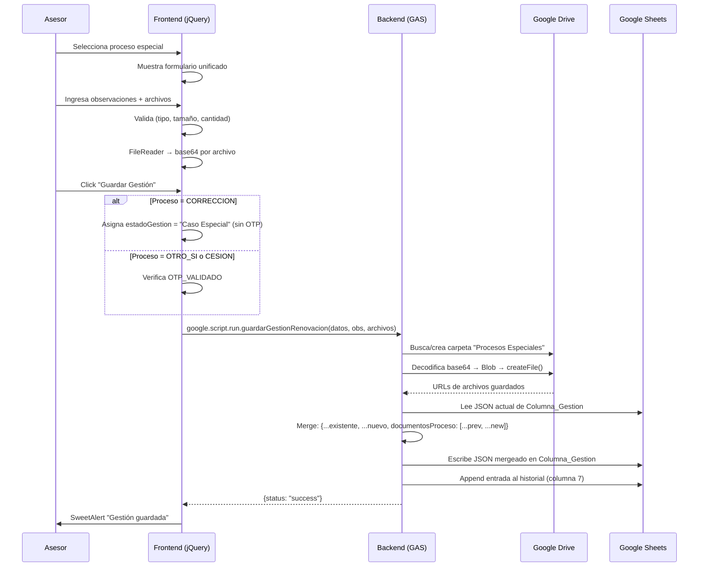

# Design Document: Gestión de Procesos Especiales

## Overview

Este diseño cubre la refactorización de la sección "Procesos Especiales" del CRM de renovaciones de pólizas. El objetivo es simplificar los formularios de "Otro Sí" y "Cesión del Contrato" a un formato unificado (observaciones + multi-file upload), agregar un tercer proceso "Correcciones" que no requiere OTP, corregir el mecanismo de carga de archivos a Google Drive usando FileReader/base64, y garantizar que los datos se almacenen en la Columna_Gestion mediante merge sin sobrescritura.

### Decisiones de Diseño Clave

1. **Formulario unificado**: Los tres procesos (Otro Sí, Cesión, Correcciones) comparten la misma estructura de formulario: textarea de observaciones + área de carga multi-archivo. Esto reduce duplicación de código y simplifica el mantenimiento.
2. **Componente de upload reutilizable**: Se crea un único componente de carga de archivos que maneja validación, preview y conversión a base64, reutilizado por los tres procesos.
3. **Correcciones sin OTP**: El proceso "Correcciones" bypasea la validación OTP y asigna automáticamente el estado "Caso Especial", diferenciándose de Otro Sí y Cesión que mantienen el flujo OTP existente.
4. **Merge no destructivo**: El backend aplica spread/merge sobre el JSON existente en Columna_Gestion, concatenando documentos nuevos al arreglo `documentosProceso` sin eliminar datos previos.
5. **Compatibilidad con stack existente**: Se mantiene Google Apps Script (backend), jQuery + Bootstrap (frontend), y Google Sheets + Drive como almacenamiento. No se introduce un nuevo framework dado que es un proyecto legacy en mantenimiento.

## Architecture

### Diagrama de Componentes

```mermaid
graph TD
    subgraph Frontend [Frontend - index.html + main.js.html]
        A[Sección Procesos Especiales] --> B[Card Otro Sí]
        A --> C[Card Cesión]
        A --> D[Card Correcciones]
        B --> E[Formulario Unificado]
        C --> E
        D --> E
        E --> F[Componente Multi-File Upload]
        E --> G[Textarea Observaciones]
        F --> H[FileReader → base64]
    end

    subgraph Backend [Backend - Renovaciones.js]
        I[guardarGestionRenovacion]
        I --> J[buscarCarpetaYGuardarArchivos / crearFolderYGuardarArchivos]
        J --> K[guardarArchivosEnCarpeta]
        I --> L[mergeJsonColumnaGestion]
        I --> M[appendHistorialObservaciones]
    end

    subgraph Storage [Almacenamiento]
        N[Google Sheets - Columna_Gestion JSON]
        O[Google Sheets - Columna 7 Historial]
        P[Google Drive - Carpeta Renovacion/Procesos Especiales]
    end

    H -->|google.script.run| I
    K --> P
    L --> N
    M --> O
```



### Flujo de Datos



## Components and Interfaces

### Frontend Components

#### 1. Sección de Selección de Proceso (`#step-procesos-especiales`)

Tres cards de selección:
- `#cardOtroSi` — Proceso "Otro Sí"
- `#cardCesion` — Proceso "Cesión del Contrato"
- `#cardCorrecciones` — Proceso "Correcciones" (nuevo)

#### 2. Formulario Unificado de Proceso Especial (`#formProcesoEspecial`)

Reemplaza los formularios individuales `#formOtroSi` y `#formCesion` con un único formulario parametrizado:

```javascript
/**
 * Muestra el formulario unificado para el proceso especial seleccionado.
 * @param {'otroSi' | 'cesion' | 'correcciones'} tipo - Tipo de proceso.
 */
function seleccionarProceso(tipo) { ... }
```

**Campos del formulario:**
- Encabezado dinámico: "Gestión de {Otro Sí | Cesión del Contrato | Correcciones}"
- Indicador de pasos: (1) Observaciones → (2) Documentos → (3) Guardar
- `textarea#observacionesProceso` — máx. 2000 caracteres, obligatorio
- Componente multi-file upload — hasta 10 archivos

#### 3. Componente Multi-File Upload

```javascript
/**
 * Inicializa el componente de carga múltiple de archivos.
 * Valida tipo (PDF, JPG, JPEG, PNG), tamaño (máx 15MB), cantidad (máx 10).
 * Muestra lista de archivos con nombre truncado, tamaño y botón eliminar.
 */
function initMultiFileUpload(containerId) { ... }

/**
 * Agrega archivos al listado validando restricciones.
 * @param {FileList} files - Archivos seleccionados por el usuario.
 * @returns {boolean} true si todos los archivos fueron aceptados.
 */
function agregarArchivos(files) { ... }

/**
 * Elimina un archivo del listado por índice.
 * @param {number} index - Índice del archivo a eliminar.
 */
function eliminarArchivo(index) { ... }

/**
 * Convierte todos los archivos seleccionados a base64 usando FileReader.
 * @returns {Promise<Array<{name: string, mimeType: string, data: string}>>}
 */
async function convertirArchivosABase64() { ... }
```

#### 4. Función de Guardado Modificada (`guardarGestionUnificada`)

Modificaciones al flujo existente:
- Si `procesoEspecialSeleccionado === 'CORRECCION'`: bypass OTP, asigna `estadoGestion = "Caso Especial"`
- Para los tres procesos: recopila archivos del componente multi-file y los envía como arreglo
- Valida observaciones obligatorias antes de enviar

### Backend Interfaces

#### 1. `guardarGestionRenovacion(datos, observaciones, archivosBase64)` (modificada)

**Cambios:**
- `archivosBase64` ahora puede contener un campo `documentosProceso` que es un arreglo de objetos `{name, mimeType, data}`
- Aplica merge no destructivo sobre el JSON existente
- Concatena URLs de documentos nuevos al arreglo `documentosProceso` existente

```javascript
/**
 * Guarda la gestión de renovación con soporte para múltiples archivos de proceso especial.
 * @param {Object} datos - Datos de la gestión (poliza, procesoEspecial, etc.)
 * @param {Object} observaciones - {observacion, fechaseguimiento, estadoGestion}
 * @param {Object} archivosBase64 - Archivos en base64. Incluye campo documentosProceso (array).
 * @returns {{status: string, message: string}}
 */
function guardarGestionRenovacion(datos, observaciones, archivosBase64) { ... }
```

#### 2. `guardarArchivosEnCarpeta(archivosBase64, datos, carpetaRenovacion, urlsNuevas)` (modificada)

**Cambios:**
- Procesa el arreglo `archivosBase64.documentosProceso` iterando cada archivo
- Nombra archivos como `{PROCESO}_{poliza}_{index}.{ext}` (ej: `OTRO_SI_12345_1.pdf`)
- Retorna arreglo de objetos `{nombre, url}` en `urlsNuevas.documentosProceso`

#### 3. `mergeJsonColumnaGestion(currentJson, newData)` (nueva)

```javascript
/**
 * Realiza merge no destructivo del JSON de Columna_Gestion.
 * Preserva campos existentes, concatena documentosProceso.
 * @param {Object} currentJson - JSON actual de la celda.
 * @param {Object} newData - Nuevos datos a mergear.
 * @returns {Object} JSON resultante del merge.
 */
function mergeJsonColumnaGestion(currentJson, newData) { ... }
```

## Data Models

### Estructura JSON de Columna_Gestion (columna 6)

```json
{
  "poliza": "12345",
  "solicitud": "SOL-001",
  "asegurado": "Juan Pérez",
  "documento": "1023456789",
  "tipoDocumento": "CC",
  "telefono1": "6011234567",
  "celular": "3001234567",
  "email": "juan@email.com",
  "direccionRiesgo": "Calle 123 #45-67",
  "canon": 1500000,
  "tipoPoliza": "nueva",
  "sarlaftEstado": "VIGENTE",
  "procesoEspecial": "OTRO_SI | CESION | CORRECCION | NINGUNO",
  "detalleFinanciero": { ... },
  "cotizacionTotal": "$1.500.000",
  "sarlaftArchivoURL": "https://drive.google.com/...",
  "propietarioDocURL": "https://drive.google.com/...",
  "documentosProceso": [
    { "nombre": "OTRO_SI_12345_1.pdf", "url": "https://drive.google.com/..." },
    { "nombre": "OTRO_SI_12345_2.jpg", "url": "https://drive.google.com/..." }
  ]
}
```

### Estructura de Entrada del Historial (columna 7)

```json
[
  {
    "fecha": "15/04/2025 10:30:00",
    "usuario": "asesor@proyectivaseguros.com",
    "observacion": "Se solicita corrección en la dirección del riesgo",
    "estado": "Caso Especial",
    "seguimiento": "N/A",
    "procesoEspecial": "CORRECCION"
  }
]
```

### Modelo de Archivo para Upload (Frontend)

```javascript
/** @typedef {Object} ArchivoSeleccionado
 * @property {File} file - Objeto File del navegador
 * @property {string} name - Nombre del archivo (truncado a 50 chars para display)
 * @property {string} fullName - Nombre completo del archivo
 * @property {number} size - Tamaño en bytes
 * @property {string} sizeDisplay - Tamaño formateado (KB/MB)
 * @property {string} mimeType - Tipo MIME del archivo
 */

/** @typedef {Object} ArchivoBase64
 * @property {string} name - Nombre original del archivo
 * @property {string} mimeType - Tipo MIME
 * @property {string} data - Contenido en base64 (sin prefijo data:)
 */
```

### Constantes de Validación

```javascript
const PROCESO_ESPECIAL_CONFIG = {
  MAX_ARCHIVOS: 10,
  MAX_SIZE_BYTES: 15 * 1024 * 1024, // 15 MB
  FORMATOS_PERMITIDOS: ['application/pdf', 'image/jpeg', 'image/png'],
  EXTENSIONES_PERMITIDAS: ['.pdf', '.jpg', '.jpeg', '.png'],
  MAX_OBSERVACIONES_CHARS: 2000
};

const PROCESO_TIPOS = {
  OTRO_SI: { key: 'OTRO_SI', label: 'Otro Sí', prefix: 'OTRO_SI' },
  CESION: { key: 'CESION', label: 'Cesión del Contrato', prefix: 'CESION' },
  CORRECCION: { key: 'CORRECCION', label: 'Correcciones', prefix: 'CORRECCION' }
};
```

## Correctness Properties

*A property is a characteristic or behavior that should hold true across all valid executions of a system — essentially, a formal statement about what the system should do. Properties serve as the bridge between human-readable specifications and machine-verifiable correctness guarantees.*

### Property 1: Validación de formulario bloquea guardado cuando faltan campos obligatorios

*For any* tipo de proceso especial (OTRO_SI, CESION, CORRECCION) y cualquier estado del formulario, si el campo de observaciones está vacío o compuesto solo de espacios en blanco, o si no hay al menos 1 archivo cargado (para Otro Sí), el sistema SHALL impedir el guardado y retornar un error de validación.

**Validates: Requirements 1.5, 2.5, 3.6, 4.4**

### Property 2: Validación de archivos acepta/rechaza correctamente según tipo y tamaño

*For any* archivo con un mimeType y un tamaño dado, la función de validación SHALL aceptar el archivo si y solo si su mimeType está en ['application/pdf', 'image/jpeg', 'image/png'] Y su tamaño es ≤ 15 MB. En cualquier otro caso, SHALL rechazarlo.

**Validates: Requirements 1.6, 5.3, 5.4, 5.5, 6.6**

### Property 3: El conteo de archivos nunca excede 10 tras cualquier secuencia de operaciones

*For any* secuencia de operaciones de agregar y eliminar archivos, el número total de archivos aceptados en el componente de upload SHALL ser siempre ≤ 10. Si una operación de agregar causaría que el total supere 10, los archivos excedentes SHALL ser rechazados.

**Validates: Requirements 5.1, 5.2, 5.7**

### Property 4: Requerimiento de OTP depende del tipo de proceso

*For any* intento de guardado, si el procesoEspecialSeleccionado es 'CORRECCION', el sistema SHALL omitir la verificación OTP y proceder al guardado. Si el procesoEspecialSeleccionado es 'OTRO_SI' o 'CESION', el sistema SHALL requerir que el estado sea OTP_VALIDADO antes de permitir el guardado.

**Validates: Requirements 4.1, 4.2**

### Property 5: Guardado de Correcciones produce estado y procesoEspecial correctos

*For any* guardado exitoso con proceso "Correcciones", el JSON resultante en Columna_Gestion SHALL contener `procesoEspecial: "CORRECCION"` y el campo `estadoGestion` SHALL ser "Caso Especial". La entrada en el historial SHALL contener `procesoEspecial: "CORRECCION"` y `estado: "Caso Especial"`.

**Validates: Requirements 3.5, 4.3, 4.5**

### Property 6: Append al historial preserva todas las entradas previas

*For any* historial existente (arreglo de N entradas) y una nueva entrada de observación, el historial resultante SHALL contener exactamente N+1 entradas, donde las primeras N son idénticas a las previas y la última es la nueva entrada con fecha, usuario, observacion, estado, seguimiento y procesoEspecial.

**Validates: Requirements 7.2**

### Property 7: Concatenación de documentosProceso preserva URLs previas

*For any* arreglo existente de documentosProceso con M elementos y un nuevo conjunto de K documentos, el arreglo resultante SHALL tener exactamente M+K elementos, donde los primeros M son idénticos a los previos y los últimos K son los nuevos documentos con sus nombres y URLs.

**Validates: Requirements 6.4, 7.3, 7.5**

### Property 8: Merge de JSON preserva campos existentes no actualizados

*For any* JSON existente en Columna_Gestion con un conjunto de campos C y un objeto de actualización con un subconjunto de campos U, el JSON resultante SHALL contener todos los campos de C con sus valores originales para aquellos campos que no están en U, y los valores actualizados para los campos que sí están en U.

**Validates: Requirements 7.4, 7.6**

### Property 9: Display de archivos trunca nombre a 50 caracteres y formatea tamaño

*For any* archivo con nombre de longitud L y tamaño S bytes, la función de display SHALL mostrar: el nombre truncado a 50 caracteres (con "..." si L > 50), y el tamaño formateado como KB (si S < 1MB) o MB (si S ≥ 1MB) con máximo 2 decimales.

**Validates: Requirements 5.6**

### Property 10: Nomenclatura de archivos en backend sigue el patrón convencional

*For any* archivo guardado en Google Drive para un proceso especial, el nombre SHALL seguir el formato `{PREFIJO}_{poliza}_{index}.{extension}` donde PREFIJO es uno de [OTRO_SI, CESION, CORRECCION], poliza es el número de póliza, index es el número secuencial del archivo (1-based), y extension es la extensión original del archivo.

**Validates: Requirements 6.2**

## Error Handling

### Frontend

| Escenario | Comportamiento | Mensaje al Usuario |
|-----------|---------------|-------------------|
| Archivo excede 15 MB | Rechazar antes de agregar a la lista | "El archivo {nombre} excede el tamaño máximo de 15 MB" |
| Formato no permitido | Rechazar antes de agregar | "Formato no permitido. Solo se aceptan: PDF, JPG, PNG" |
| Más de 10 archivos | Rechazar excedentes | "Máximo 10 documentos permitidos. Se rechazaron {n} archivos" |
| Observaciones vacías al guardar | Bloquear guardado | "Las observaciones son obligatorias" |
| Error en FileReader | Mostrar error, no enviar | "Error al procesar el archivo {nombre}. Intente nuevamente" |
| Error de conexión con backend | SweetAlert error | "Error de conexión. Intente nuevamente" |
| OTP no validado (Otro Sí/Cesión) | Bloquear guardado | "Debe completar la validación OTP antes de guardar" |

### Backend

| Escenario | Comportamiento | Respuesta |
|-----------|---------------|-----------|
| Póliza no encontrada en BD | Retornar error | `{status: "error", message: "Póliza no encontrada en BD."}` |
| Error de Google Drive | Retornar error, no persistir | `{status: "error", message: "El servicio de Google Drive presentó fallas..."}` |
| JSON inválido en Columna_Gestion | Inicializar objeto nuevo | Crear JSON fresco con datos actuales |
| Error al escribir en Sheets | Retornar error | `{status: "error", message: "Error al guardar en la base de datos..."}` |
| Archivo base64 corrupto | Log error, continuar con otros | Guardar los archivos válidos, reportar los fallidos |

### Estrategia de Reintentos (Backend)

Se mantiene la función `retryDrive` existente con backoff exponencial (5 reintentos, delay inicial 300ms, factor x2) para todas las operaciones de Google Drive.

## Testing Strategy

### Unit Tests (Example-Based)

Enfocados en escenarios específicos y verificación de UI:

1. **Renderizado de formularios**: Verificar que al seleccionar cada proceso, se muestra el formulario correcto con el encabezado y pasos esperados (Req 1.1-1.4, 2.1-2.4, 3.1-3.4)
2. **Eliminación de campos legacy**: Verificar que los campos antiguos de Cesión (tipoDoc, numDoc, nombre, telefono) no están presentes (Req 2.2)
3. **Uso de FileReader**: Verificar que la conversión usa FileReader y no createObjectURL (Req 6.7)
4. **Creación de carpeta**: Verificar que si "Procesos Especiales" no existe, se crea (Req 6.3)
5. **Error de Drive**: Verificar que un fallo de Drive retorna error sin persistir datos (Req 6.5)
6. **JSON inválido**: Verificar que un JSON corrupto en Columna_Gestion resulta en inicialización de objeto nuevo (Req 7.7)
7. **Error de escritura**: Verificar atomicidad — si falla la escritura, no hay cambios parciales (Req 7.8)

### Property-Based Tests

Librería recomendada: **fast-check** (JavaScript) — compatible con el entorno de testing de Google Apps Script mediante clasp + Jest local.

Configuración: mínimo 100 iteraciones por propiedad.

| Property | Tag | Generadores |
|----------|-----|-------------|
| 1 | Feature: gestion-procesos-especiales, Property 1: Validación bloquea guardado sin campos obligatorios | Strings (vacíos, whitespace, válidos) × File arrays (vacíos, con archivos) × Proceso tipo |
| 2 | Feature: gestion-procesos-especiales, Property 2: Validación acepta/rechaza archivos por tipo y tamaño | MimeTypes (válidos + inválidos) × Sizes (0 a 20MB) |
| 3 | Feature: gestion-procesos-especiales, Property 3: Conteo de archivos nunca excede 10 | Secuencias de operaciones add(n)/remove(i) |
| 4 | Feature: gestion-procesos-especiales, Property 4: OTP depende del tipo de proceso | Proceso tipo × Estado OTP (validado/no validado) |
| 5 | Feature: gestion-procesos-especiales, Property 5: Correcciones produce estado correcto | Payloads aleatorios con proceso=CORRECCION |
| 6 | Feature: gestion-procesos-especiales, Property 6: Append historial preserva entradas previas | Historiales de 0-50 entradas × Nueva entrada |
| 7 | Feature: gestion-procesos-especiales, Property 7: Concatenación documentosProceso preserva previos | Arrays de 0-20 docs previos × 1-10 docs nuevos |
| 8 | Feature: gestion-procesos-especiales, Property 8: Merge JSON preserva campos no actualizados | JSON objects con 1-20 campos × Updates con subconjuntos |
| 9 | Feature: gestion-procesos-especiales, Property 9: Display trunca nombre y formatea tamaño | Strings de 1-200 chars × Sizes de 1B a 15MB |
| 10 | Feature: gestion-procesos-especiales, Property 10: Nomenclatura de archivos sigue patrón | Polizas (numéricos) × Prefijos × Índices × Extensiones |

### Integration Tests

1. **Flujo completo de guardado**: Guardar un proceso especial con archivos y verificar que Drive y Sheets se actualizan correctamente
2. **Merge con datos reales**: Leer un JSON existente de la hoja, aplicar merge, verificar resultado
3. **Creación de carpetas**: Verificar la estructura de carpetas en Drive (Renovacion/Procesos Especiales)

